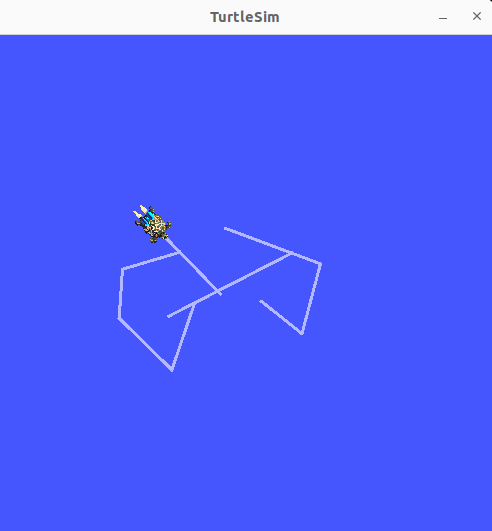

# MTRX5700 Environment setup - README


**WARNING: The MXLab computers and Turtlebots are using Ubuntu 22.04 and ROS2 Humble, so any code written in Ubuntu 20.04 with ROS2 Foxy must be transferrable to Ubuntu 22.04 with ROS2 Humble. Proceed with caution.**

## Instructions


### Setting up the framework
The code we provide for the assignments were tested on Ubuntu 20.04 with ROS2 Foxy and Gazebo 11.11.0.
Please try to match this configuration if you are using your personal computers.
The code may also work on ROS2 Galactic (not supported), but it has not been tested.

#### Pre-requisites (Only for personal computers)

1. Install [Ubuntu 20.04](https://releases.ubuntu.com/focal/).
2. Install ROS2 Foxy following the instructions [here](https://docs.ros.org/en/foxy/Installation/Alternatives/Ubuntu-Development-Setup.html).
3. Install dependencies
Handy hint - if you’d like to walk away while your computer does this, add -y to the end of every apt install line and execute this as a bash script. Some googling will go a long way here.
```bash
sudo apt install libboost-all-dev cmake
sudo apt install libtbb-dev
sudo apt install git
sudo apt install inkscape

# Point cloud library
sudo apt install libpcl-dev

# Terminal helpers (tmux multiplexer and terminator)
sudo add-apt-repository ppa:gnome-terminator

sudo apt-get update

sudo apt-get install terminator

sudo apt install tmux


# VS Code
sudo apt-get install wget gpg
wget -qO- https://packages.microsoft.com/keys/microsoft.asc | gpg --dearmor > packages.microsoft.gpg
sudo install -D -o root -g root -m 644 packages.microsoft.gpg /etc/apt/keyrings/packages.microsoft.gpg
sudo sh -c 'echo "deb [arch=amd64,arm64,armhf signed-by=/etc/apt/keyrings/packages.microsoft.gpg] https://packages.microsoft.com/repos/code stable main" > /etc/apt/sources.list.d/vscode.list'
rm -f packages.microsoft.gpg


sudo apt install apt-transport-https
sudo apt update
sudo apt install code # or code-insiders


# Github Commandline
type -p curl >/dev/null || sudo apt install curl -y
curl -fsSL https://cli.github.com/packages/githubcli-archive-keyring.gpg | sudo dd of=/usr/share/keyrings/githubcli-archive-keyring.gpg \
&& sudo chmod go+r /usr/share/keyrings/githubcli-archive-keyring.gpg \
&& echo "deb [arch=$(dpkg --print-architecture) signed-by=/usr/share/keyrings/githubcli-archive-keyring.gpg] https://cli.github.com/packages stable main" | sudo tee /etc/apt/sources.list.d/github-cli.list > /dev/null \
&& sudo apt update \
&& sudo apt install gh -y


# ROS2 Foxy
sudo apt install software-properties-common
sudo add-apt-repository universe
sudo apt update && sudo apt install curl -y
sudo curl -sSL https://raw.githubusercontent.com/ros/rosdistro/master/ros.key -o /usr/share/keyrings/ros-archive-keyring.gpg
echo "deb [arch=$(dpkg --print-architecture) signed-by=/usr/share/keyrings/ros-archive-keyring.gpg] http://packages.ros.org/ros2/ubuntu $(. /etc/os-release && echo $UBUNTU_CODENAME) main" | sudo tee /etc/apt/sources.list.d/ros2.list > /dev/null
sudo apt update

sudo apt install ros-foxy-desktop
sudo apt-get install ros-foxy-ros2-control ros-foxy-ros2-controllers ros-foxy-moveit ros-foxy-moveit-resources ros-foxy-derived-object-msgs ros-foxy-gazebo-ros ros-foxy-gazebo-ros2-control ros-foxy-tf2-eigen ros-foxy-actionlib-msgs ros-foxy-control-msgs ros-foxy-controller-interface ros-foxy-controller-manager ros-foxy-effort-controllers ros-foxy-geometry-msgs ros-foxy-hardware-interface ros-foxy-ur-msgs ros-foxy-ur-client-library ros-foxy-ur-dashboard-msgs ros-foxy-ur-description python3-pymodbus ros-foxy-diagnostic-updater

# OpenCV
# Install minimal prerequisites (Ubuntu 18.04 as reference)
mkdir ~/opencv && cd ~/opencv
sudo apt update && sudo apt install -y cmake g++ wget unzip
# Download and unpack sources
wget -O opencv.zip https://github.com/opencv/opencv/archive/4.x.zip
wget -O opencv_contrib.zip https://github.com/opencv/opencv_contrib/archive/4.x.zip
unzip opencv.zip
unzip opencv_contrib.zip
# Create build directory and switch into it
mkdir -p build && cd build
# Configure
cmake -DOPENCV_EXTRA_MODULES_PATH=../opencv_contrib-4.x/modules ../opencv-4.x
# Build
cmake --build .
cd 

# Tello Drones (does not exist for foxy, unofficial alternative here: https://github.com/tentone/tello-ros2)
mkdir -p ~/ros2_mtrx5700ws/src && cd ~/ros2_mtrx5700ws/src
git clone https://github.com/tentone/tello-ros2.git

# Turtlebot 3
sudo apt-get install ros-foxy-joy ros-foxy-teleop-twist-joy ros-foxy-teleop-twist-keyboard ros-foxy-laser-proc ros-foxy-nav2-amcl ros-foxy-nav2-map-server ros-foxy-urdf ros-foxy-xacro ros-foxy-compressed-image-transport ros-foxy-rqt* ros-foxy-rviz2 ros-foxy-navigation2 ros-foxy-interactive-markers ros-foxy-dynamixel-sdk ros-foxy-turtlebot3*

# Pip installs (Machine learning, visualisation)
sudo apt-get install python3-pip
pip3 install jupyterlab
pip3 install numpy scikit-image pandas matplotlib scipy transformations
pip3 install open3d
pip3 install opencv-python
pip3 install torch torchvision torchaudio torch_geometric
pip3 install jax jaxlib flax pillow tensorboard tensorflow gin-config dm-pix rawpy mediapy immutabledict ml_collections jaxcam chex 
pip3 install av
pip3 install spatialgeometry spatialmath-python roboticstoolbox-python swift-sim qpsolvers pyyaml
pip3 install polyscope


# GTSAM Install (https://gtsam.org/get_started/)
sudo add-apt-repository ppa:borglab/gtsam-release-4.0
sudo apt install libgtsam-dev libgtsam-unstable-dev


# Arduino IDE
sudo snap install arduino

# Realsense
sudo apt install apt-transport-https
sudo mkdir -p /etc/apt/keyrings
curl -sSf https://librealsense.intel.com/Debian/librealsense.pgp | sudo tee /etc/apt/keyrings/librealsense.pgp > /dev/null

echo "deb [signed-by=/etc/apt/keyrings/librealsense.pgp] https://librealsense.intel.com/Debian/apt-repo `lsb_release -cs` main" | \
sudo tee /etc/apt/sources.list.d/librealsense.list

sudo apt-get update
sudo apt-get install librealsense2-dkms librealsense2-utils librealsense2-dev librealsense2-dbg


# (Optional!) Docker
# Add Docker's official GPG key:
sudo apt-get update
sudo apt-get install ca-certificates curl gnupg
sudo install -m 0755 -d /etc/apt/keyrings
curl -fsSL https://download.docker.com/linux/ubuntu/gpg | sudo gpg --dearmor -o /etc/apt/keyrings/docker.gpg
sudo chmod a+r /etc/apt/keyrings/docker.gpg

# Add the repository to Apt sources:
echo \
  "deb [arch=$(dpkg --print-architecture) signed-by=/etc/apt/keyrings/docker.gpg] https://download.docker.com/linux/ubuntu \
  $(. /etc/os-release && echo "$VERSION_CODENAME") stable" | \
  sudo tee /etc/apt/sources.list.d/docker.list > /dev/null
sudo apt-get update

sudo apt-get install docker-ce docker-ce-cli containerd.io docker-buildx-plugin docker-compose-plugin
```

4. Install colcon and rosdep (https://docs.ros.org/en/foxy/Tutorials/Beginner-Client-Libraries/Creating-A-Workspace/Creating-A-Workspace.html)
```bash
sudo apt install python3-colcon-common-extensions
sudo apt-get install python3-rosdep

sudo rosdep init
rosdep update # do not run as sudo
```


#### From here onwards, these steps apply to personal computers only.

#### Setting up colcon workspace
The computers in MXLab have the above configuration. All the dependencies for this code to run have been installed. Please type the following commands in a terminal one after the other.
1. Source ROS2 commands. (Must run this in each new bash terminal!)
```bash
source /opt/ros/foxy/setup.bash
```
On your personal computer, you can automate the command to run in each new bash terminal:
```bash
echo "source /opt/ros/foxy/setup.bash" >> ~/.bashrc && source /opt/ros/foxy/setup.bash
```

2. Create and initialise a new colcon workspace. You may choose any name you like.
Here we chose **`ros2_mtrx5700ws`** and it is located in the home directory. The standard naming convention is `ros2_ws`.
```bash
mkdir -p ~/ros2_mtrx5700ws/src && cd ~/ros2_mtrx5700ws

rosdep install -i --from-path src --rosdistro foxy -y
colcon build
```

3. (Optional) Download ROS2 Foxy tutorials, such as turtlesim, and build packages using colcon.
```bash
cd ~/ros2_mtrx5700ws/src
git clone https://github.com/ros/ros_tutorials.git -b foxy-devel

rosdep install -i --from-path src --rosdistro foxy -y
colcon build

ros2 run turtlesim turtlesim_node & ros2 run turtlesim turtle_teleop_key
```
Follow the instructions to move the turtle around. This is what should happen:

<p align="center" width="100%">
    
</p>

In a separate terminal, run:
```bash
source /opt/ros/foxy/setup.bash 
ros2 topic echo /turtle1/pose
```
